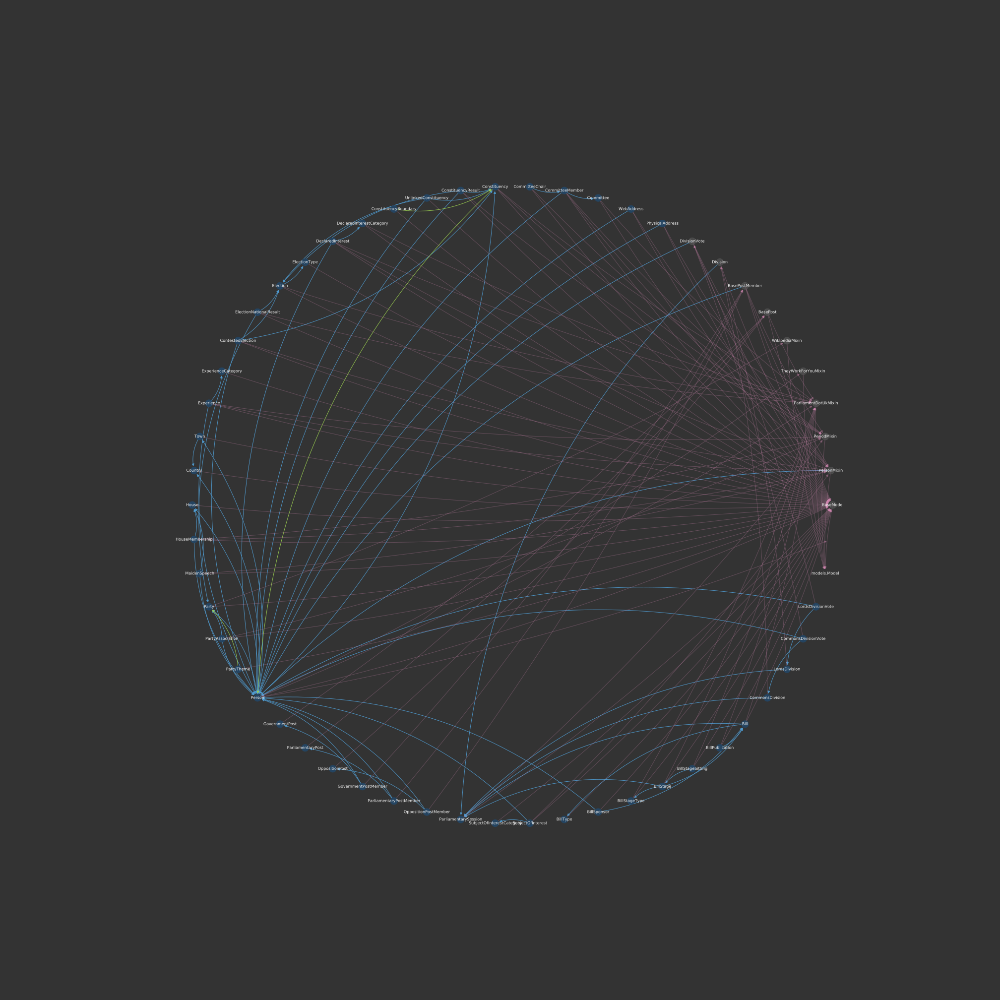

A tool to visualise relationships between Django Models in a project.

# Requirements

Dataclasses are used so Python 3.8 is required. This is a quick project I made
to use myself. If you want to use an older version of Python then you will need
to replace the Field and PyClass classes.

# Installation

    git clone https://github.com/beatonma/django-model-dependencies
    cd django-model-dependencies/

    # activate virtual environment here if you want

    # then
    python setup.py install

Then you can run it with:

    djmodgraph 'path/to/directory'

or to build a graph of the current directory:

    djmodgraph .

# Testing

Clone the repo as above then run:

    python setup.py test
